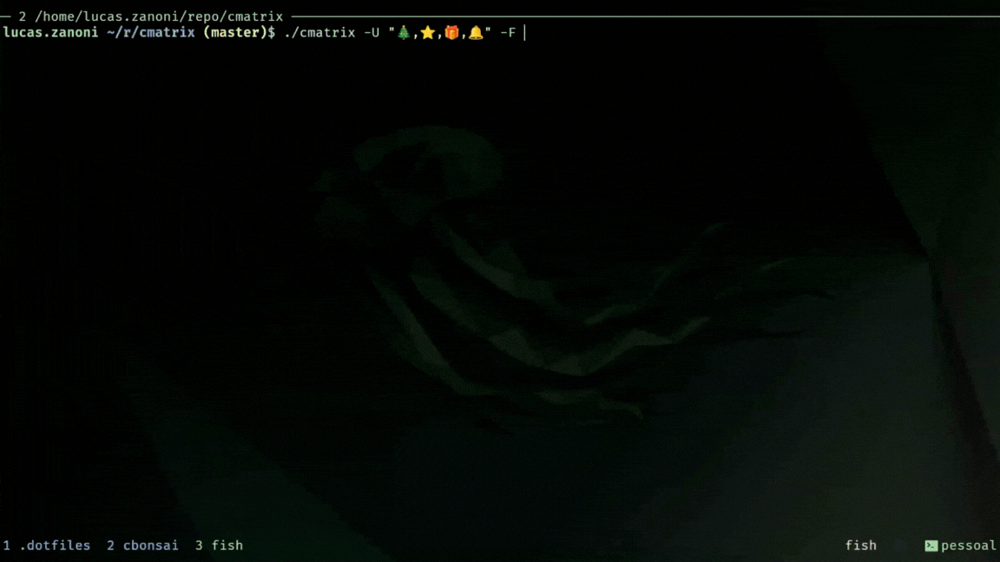

<h1 align="center">CMatrix (Custom Characters Fork)</h1>

<h3 align="center"> Matrix like effect in your terminal with custom emoji support! </h3>

</p>
<p align="center">
  <a href="./COPYING">
    
  </a>
  
</p>

> **Note:** This is a fork of [abishekvashok/cmatrix](https://github.com/abishekvashok/cmatrix) with custom character support based on [HlibShutov's PR](https://github.com/HlibShutov/cmatrix/tree/master). All credit for the original cmatrix goes to **Chris Allegretta** and **Abishek V Ashok**.


## :sparkles: What's New in This Fork

This fork adds **custom character support** via the `-U` flag, allowing you to use emojis and unicode characters with configurable frequency!

### New Options
- **`-U <chars>`**: Use custom characters (comma-separated list)
- **`-F <0-100>`**: Set frequency of custom characters (default: 50)

### Examples
```sh
# Christmas theme with 80% emoji frequency
cmatrix -U "🎄,⭐,🎁,🔔" -F 80

# Hearts theme with 100% emojis
cmatrix -U "❤️,💕,💖,💗" -F 100

# Mix emojis with regular Matrix characters
cmatrix -U "☀️,🌙,⭐,✨" -F 30
```


## :camera: Demo

<p align="center">

</p>


## Contents
- [Overview](#overview)
- [Build Dependencies](#build-dependencies)
- [Installation](#installation)
    - [Using Nix Flakes (Recommended)](#using-nix-flakes-recommended)
    - [Using configure](#using-configure)
    - [Using CMake](#using-cmake)
- [Demo](#demo)
- [Usage](#usage)
- [Credits](#credits)
- [License](#license)


## :cloud: Overview

CMatrix is based on the screensaver from The Matrix website. It shows text
flying in and out in a terminal like as seen in "The Matrix" movie. It can
scroll lines all at the same rate or asynchronously and at a user-defined
speed.

This fork extends the original with the ability to use custom characters (including emojis) to create themed matrix effects!

> :grey_exclamation:`Disclaimer` : We are in no way affiliated in any way with the movie "The Matrix", "Warner Bros" nor
any of its affiliates in any way, just fans.


## :open_file_folder: Build Dependencies

You'll need ncurses (or ncursesw for wide character support) to compile this.

##### :small_blue_diamond: For Linux
```sh
# Debian/Ubuntu
sudo apt install libncursesw5-dev

# Fedora/RHEL
sudo dnf install ncurses-devel

# Arch Linux
sudo pacman -S ncurses
```

Check your ncurses version:
```sh
ldconfig -p | grep ncurses
```


## :package: Installation

### Using Nix Flakes (Recommended)

If you use NixOS or have Nix with flakes enabled:

```sh
# Run directly without installing
nix run github:Castrozan/cmatrix

# Install to your profile
nix profile install github:Castrozan/cmatrix

# Add to your NixOS configuration or home-manager
{
  inputs.cmatrix.url = "github:Castrozan/cmatrix";
  
  # Then in your packages:
  environment.systemPackages = [
    inputs.cmatrix.packages.${system}.default
  ];
}
```

### Using `configure`
```sh
autoreconf -i  # skip if using released tarball
./configure
make
sudo make install
```

### Using CMake
```sh
mkdir -p build
cd build
cmake ..
make
sudo make install
```


## :bookmark_tabs: Usage

### Basic Usage
```sh
cmatrix
```

### With Custom Characters
```sh
# Emoji themed matrix
cmatrix -U "🎄,⭐,🎁,🔔" -F 80

# Mix with classic matrix look
cmatrix -lba -U "👾,🎮,💾,🖥️" -F 50
```

### All Options
```sh
cmatrix [-abBflohnsmVx] [-u update] [-C color] [-U chars] [-F frequency]
```

- `-a`: Asynchronous scroll
- `-b`: Bold characters on
- `-B`: All bold characters
- `-f`: Force the linux $TERM type to be on
- `-l`: Linux mode (uses matrix console font)
- `-o`: Use old-style scrolling
- `-h`: Print usage and exit
- `-n`: No bold characters
- `-s`: "Screensaver" mode
- `-m`: Matrix mode (fewer updates)
- `-V`: Print version information and exit
- `-u [0-9]`: Screen update delay
- `-C [color]`: Use this color for matrix (default green)
- `-U [chars]`: Custom characters (comma-separated)
- `-F [0-100]`: Custom character frequency (default 50)

For more options: `cmatrix -h` or `man cmatrix`

_To get the program to look most like the movie: `cmatrix -lba`_  
_To get the program to look most like the Win/Mac screensaver: `cmatrix -ol`_


## :busts_in_silhouette: Credits

### Original Authors
- **Chris Allegretta** - Original author of cmatrix
- **Abishek V Ashok** - Current maintainer of [abishekvashok/cmatrix](https://github.com/abishekvashok/cmatrix)

### This Fork
- **Lucas Zanoni** - Maintainer of this fork at [Castrozan/cmatrix](https://github.com/Castrozan/cmatrix)
- Based on custom character implementation from [HlibShutov/cmatrix](https://github.com/HlibShutov/cmatrix/tree/master)

### Contributors to Original Project
- **Krisjon Hanson** and **Bjoern Ganslandt** - Bold support, cursor removal, `-u` and `-l` modes
- **Adam Gurno** - Multi-color support
- **Garrick West** - Debian consolefont dir support
- **Nemo** - Design thoughts and continuous support
- **John Donahue** - Transparent term support
- **Ben Esacove** - Redhat 6 compatibility
- **jwz** - xmatrix module for xscreensaver
- **Sumit Kumar Soni** - README beautification
- Everyone who has contributed to the original project with issues, PRs, and feedback

### Special Thanks
- The makers of The Matrix for one kickass movie!
- Chris Allegretta's girlfriend **Amy** for not killing him when he stayed up till 3 AM writing code


## :page_facing_up: License
This software is provided under the GNU GPL v3. [View License](./COPYING)

Original cmatrix: Copyright (C) 1999-2017 Chris Allegretta, 2017-Present Abishek V Ashok  
This fork: Maintained by Lucas Zanoni
